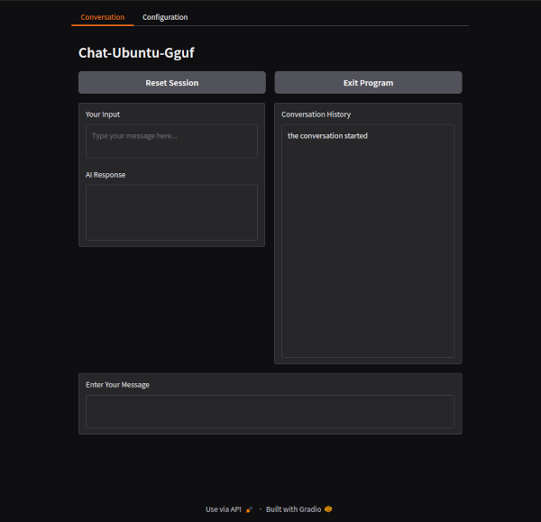

# Chat-Ubuntu-Gguf
- Status: Alpha

### Project details
The, conversion and re-engineer, of my WSL based ChatBot, to being Ubuntu 24 native....
- Gradio Interface with model is loaded, so upon proper exit, this should shutdown and unload, correctly, models and processes.
- we have 4 python scripts in total between "./" and "./scripts", plus the 1 bash installer-launcher script in `./`, while the rest self generate in `./data`; enabling editing by anyone with max 5 files for free in claude_sonnet.
- a rotation of 2 prompts for, conversation and consolidation of events, producing basic context aware conversations. Will investigave putting both into 1 with the the newer models.
- the main_script checking relevant folders for required files and performing any required basic maintenance, all before popping up the gradio interface in browser.

### Project Plans
We are at ALPHA stage...
1. Ensure the gradio interface is correctly popping up in default browser.
2. Ensure Gradio interface has correct layout and configuration.
3. Continue with, Test and Bugfix, for all features/options, until stable.
4. Test, conversation and prompting, and examine responses, then improve.
3. Upon correct and working version, then Optimize for Less Overall Characters, more advanced programming.
2. Test and Bugfix, all options and features, soes everything still works.
4. Re-Structure Code/Scripts, ensure code is, appropriately and optimally, located in correctly themed/labeled script.
2. Test and Bugfix, all options and features, soes everything still works.
2. Release.
5. work on expansion of features, this will require a list of wanted features, then break down to, least code and best advantage, to round off features.
6. release final version.
8. update for new models as required.

### File Structure
- Initial File Structure...
```
./
├── Chat-Ubuntu-Gguf.sh        # Main Bash launcher script
├── main_script.py             # Entry point script
├── requirements.txt           # Dependencies for the virtual environment
├── prompts/
│   ├── consolidate.txt        # Prompt template for consolidation tasks
│   ├── converse.txt           # Prompt template for conversation tasks
├── scripts/
│   ├── interface.py           # Gradio interface logic
│   ├── model.py               # GGUF model handling and interaction
│   ├── utility.py             # Utility functions
└── LICENSE.txt                # License file for the project
```
- Files Created by Installation...
```
./
├── data/
│   ├── temporary.py           # Created by the installer, holds global variables
│   ├── __init__.py            # Created by the installer to mark the directory as a Python package
│   ├── persistent.yaml        # Created by the installer, holds default configuration
├── scripts/
│   ├── terminate_gradio.py    # Terminate gradio in the runspace.
├── venv/                      # Venv local install folder avoiding system conflict.
│   ├── *                      # Various libraries installed from `./requirements.txt`.
├── logs/                      # (Empty) Will contain any produced log files.
├── models/                    # (Empty) Directory for, `*.GGUF` and `model_config.json` ,files
```

### FEATURES
- Model-Driven: Focused on GGUF-format models with accompanying configuration files.
- Gradio Interface: A browser-based interactive interface tied seamlessly into terminal operations.
- Integrated Setup and Operation: Through a single Bash launcher script that manages installation, execution, and cleanup.
- Folder and File Management: Automated handling of configuration files, logs, and persistent data (YAML-based).
- Modularity: Python scripts are designed to work together with clear roles (e.g., model handling, interface logic).
- Persistence: Session data, settings, and configurations are retained across restarts.
- Optimized for Ubuntu: Specifically tailored to Ubuntu 24.04–24.10 and AMD architecture.

### Preview
- Alpha Gradio Interface - First working version...



- The Bash Installer/Launcher - under development...
```
================================================================================
    Chat-Ubuntu-Gguf
================================================================================


    1. Launch Main Program

    2. Run Setup-Installer


--------------------------------------------------------------------------------
Selection; Menu Options = 1-2, Exit Program = X: 
```

### Example Prompts
1) "Hello there! I never thought I would see you here on the mountain..."
2) "Wow, you can actually talk? What's your story?"
3) "You look wise, do you have any ancient wisdom to share?"
4) "Tell me, Wise-Llama, what is the purpose of humanity?"

### Requirements
- Ubuntu - Its programmed on/towards Ubuntu 24.04-24.10.
- Python - It uses modern versions of Python in a VENV.
- LLMs - GGUF format with an accompanying "model_config.json" file in same dir.
- AMD - Programmed on AMD, not currently testing on other platforms.

### Usage
- No working version verified yet.
- When it works, it will run through "sudo ./Chat-Ubuntu-Gguf.sh" in terminal in the program folder.
- the file "Chat-Ubuntu-Gguf.sh" is a Installer and Launcher, through menu; its already done mostly.
- the python scripts search in `./models/` for the, `*.gguf` and `model_config.json`, files, and use that.
- the user is presented with gradio interface popped up in default browser, and then have terminal somewhere.
- the buttons do what you would expect, and the interface has all basic desired options available.


## DISCLAIMER:
- It is advided not to run the scripts in Alpha stage, or unexpected results may occur.
- Refer to License.Txt for terms covering usage, distribution, and modifications.
