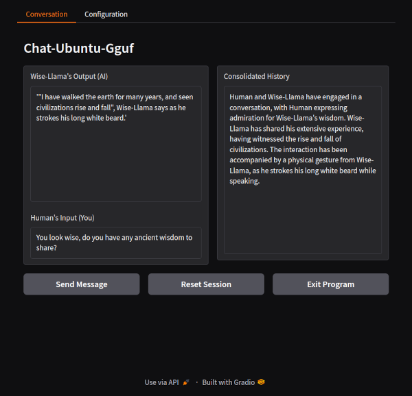
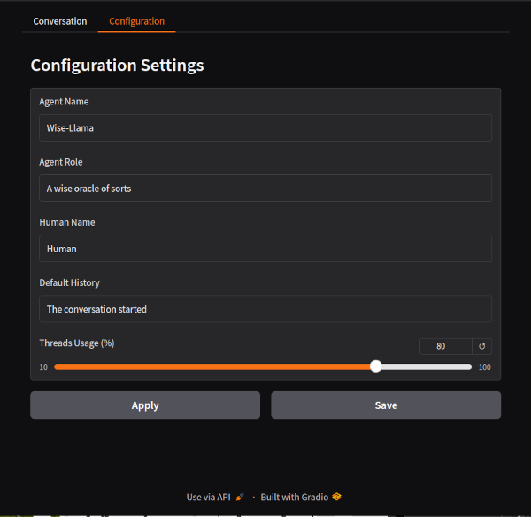

# Chat-Ubuntu-Gguf
(currently updating, wait for full release)
- Status: Working

### Description
Its a lightweight Chatbot native to Ubuntu 24, that uses Gguf models to simulate conversations with contextual awareness in a Gradio interface in your Web-Browser. There are 4 python scripts in, "./" and "./scripts", and 1 bash script in `./`, enabling editing with the maximum of 5 files upload in claude_sonnet for free account, thus, able to be modified into their own custom chatbot by anyone. The idea is its a framework able to be customised to adapt the model interference to any task or purpose, for example, personal manager, email responder, etc. Still being created, tba.  

### FEATURES
- Gguf Models: Using, Gguf-Parser and accompanying json files; auto-configuration of model parameters. 
- Gradio Interface: A browser-based interactive interface tied seamlessly into terminal operations.
- Integrated Setup and Operation: Through a single Bash launcher script that manages installation, execution, and cleanup.
- Folder and File Management: Automated handling of configuration files, logs, and persistent data (YAML-based).
- 2 Prompt rotation for, conversation and consolidation, producing context aware conversation.
- Modularity: Python scripts are designed to work together with clear roles (e.g., model handling, interface logic).
- Persistence: Session data, settings, and configurations are retained across restarts.
- Optimized for Ubuntu: Specifically tailored to Ubuntu 24.04–24.10 and AMD architecture.

### Preview
- Alpha Conversation Page...



- Alpha Configuration Page...



- The Bash Installer/Launcher - under development...
```
================================================================================
    Chat-Ubuntu-Gguf - Bash Menu
================================================================================


    1. Launch Main Program

    2. Run Setup-Installer


--------------------------------------------------------------------------------
Selection; Menu Options = 1-2, Exit Program = X: 

```

### Requirements
- Ubuntu - Its programmed on/towards Ubuntu 24.04-24.10.
- Python - It uses modern versions of Python in a VENV.
- LLMs - GGUF format Large Language Models, it will detect parameters.
- AMD - Created and Tested on AMD CPU, not testing on other hardware.

### Usage
1. When it works, it will run through "sudo ./Chat-Ubuntu-Gguf.sh" in terminal in the program folder.
2. the Installer/Launcher runs, and you should select `2` to, install requirements and setup files/folders.
3. You should then insert your `*.gguf`, and if present then, `config.json` or `model_config.json`, to the `./models` folder that was created.
4. You should then select `1` from the menu to run the main program, and a browser window should pop-up, but in failing that then right click on `http://127.0.0.1:7860` in the terminal and go to `Open Link` to do the same.
5. You will then be interacting with the browser interface, where the buttons do what you would expect, and most desired options are available.
6. After finishing your session, then click on `Exit Program` in the browser window, and then the terminal will return to the Bash menu, and then select `X` to exit correctly. 

### Example Prompts
1) "Hello there! I never thought I would see you here on the mountain..."
2) "Wow, I bet you can actually talk? A talking llama, I'll be rich!"
3) "You look knowledgeable, do you have wise thoughts and think wise things?"
4) "Tell me, Wise-Llama, what is humanity's purpose, and dont tell me 42!"

### Notation
- Current, testing and advised, model(s): `https://huggingface.co/MaziyarPanahi/Llama-3.1-8B-Lexi-Uncensored-V2-GGUF`.

### Development
The current plan for work is...
1. Optimize for Less Overall Characters, more advanced programming. 
2. Re-Structure Code/Scripts, ensure code is, appropriately and optimally, located in correctly themed/labeled script(s).
2. Test and Bugfix, all options and features, soes everything still works.
5. work on expansion of features, this will require a list of wanted features, then break down to, least code and best advantage, to round off features.

### File Structure
- Initial File Structure...
```
./
├── Chat-Ubuntu-Gguf.sh        # Main Bash launcher script
├── main_script.py             # Entry point script
├── requirements.txt           # Dependencies for the virtual environment
├── prompts/
│   ├── consolidate.txt        # Prompt template for consolidation tasks
│   ├── converse.txt           # Prompt template for conversation tasks
├── scripts/
│   ├── interface.py           # Gradio interface logic
│   ├── model.py               # GGUF model handling and interaction
│   ├── utility.py             # Utility functions
└── LICENSE.txt                # License file for the project
```
- Files Created by Installation...
```
./
├── data/
│   ├── temporary.py           # Holds ALL global variables
│   ├── __init__.py            # to mark the directory as a Python package
│   ├── persistent.yaml        # Holds default Chatbot configuration
├── venv/                      # Venv local install folder avoiding system conflict.
│   ├── *                      # Various libraries installed from `./requirements.txt`.
├── logs/                      # (Empty) Will contain any produced log files.
├── models/                    # (Empty) Directory for, `*.GGUF` and `model_config.json` ,files
```

## DISCLAIMER:
- It is advided not to run the scripts in Alpha stage, or unexpected results may occur.
- Refer to License.Txt for terms covering usage, distribution, and modifications.
