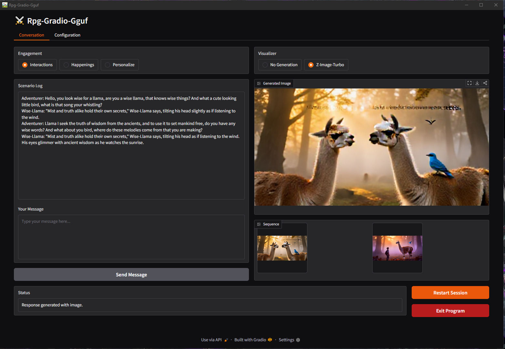
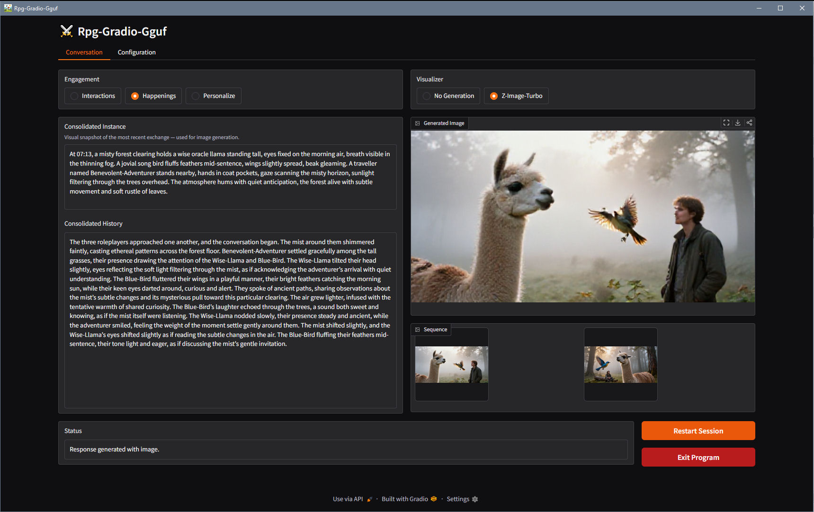
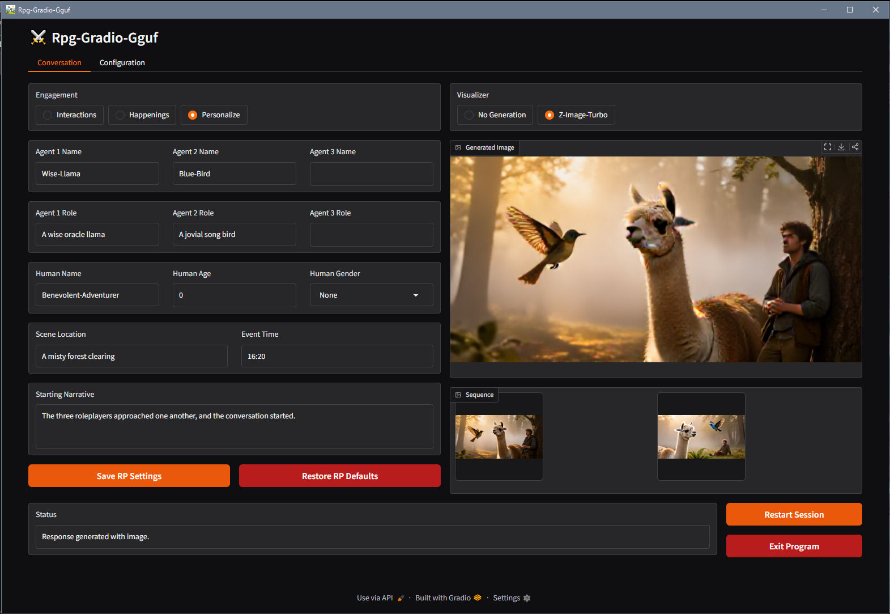
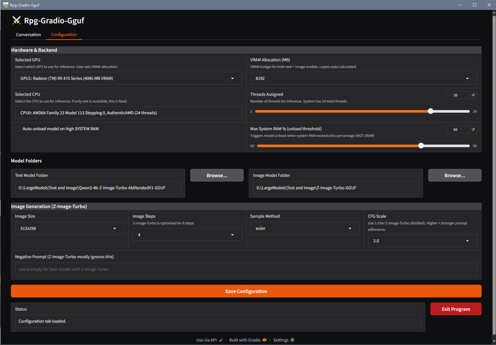

# Rpg-Gradio-Gguf
- Status: Working - Prompting was fixed, and now images are generating more accurately towards the, scenario and actors present. Still some planned expansion/improvements, and deep testing/improvement, but for now its working quite well (see images). 

### Description
Its a Chatbot with, text and image, generation, tuned to RPG, that uses Gguf models to simulate limitless roleplaing in a Gradio interface in Web-Browser interface.

### FEATURES
- Gguf Models: Compressed large language models with auto-configuration of model parameters. 
- Gradio Interface: A browser-based interactive interface tied seamlessly into terminal operations.
- Integrated Setup and Operation: Through a single Batch launcher script that manages installation and execution.
- 3 Prompt rotation for, conversation and consolidation and image generation, producing context aware experience.
- Persistence: Session data, settings, and configurations are retained across restarts.

### Preview
- The Conversation page...



- The Happenings panel...



- The Personalization panel...



- The Configuration page...



<details>
<summary>The installation processes, installing in program folder..(v2.04)</summary>

    ```
    ===============================================================================
        Rpg-Gradio-Gguf - Installation / Repair
    ===============================================================================
    
    
    Python version: 3.12.4
    
    [1/6] Creating directory structure...
      OK: ./data/
      OK: ./models/
      OK: ./models/text/
      OK: ./models/image/
      OK: ./scripts/
      OK: ./generated/
      OK: ./logs/
    
    [2/6] Creating virtual environment...
      Virtual environment already exists, skipping creation.
    
    [3/6] Installing Python packages into venv...
      -> Upgrading pip
    Requirement already satisfied: pip in .\venv\Lib\site-packages (26.0.1)
      -> Installing core packages
    Requirement already satisfied: gradio>=4.0 in .\venv\Lib\site-packages (6.6.0)
    Requirement already satisfied: Pillow in .\venv\Lib\site-packages (12.1.1)
    Requirement already satisfied: gguf-parser in .\venv\Lib\site-packages (0.1.1)
    Requirement already satisfied: pywebview>=5.0 in .\venv\Lib\site-packages (6.1)
    Requirement already satisfied: aiofiles<25.0,>=22.0 in .\venv\Lib\site-packages (from gradio>=4.0) (24.1.0)
    Requirement already satisfied: anyio<5.0,>=3.0 in .\venv\Lib\site-packages (from gradio>=4.0) (4.12.1)
    Requirement already satisfied: brotli>=1.1.0 in .\venv\Lib\site-packages (from gradio>=4.0) (1.2.0)
    Requirement already satisfied: fastapi<1.0,>=0.115.2 in .\venv\Lib\site-packages (from gradio>=4.0) (0.132.0)
    Requirement already satisfied: ffmpy in .\venv\Lib\site-packages (from gradio>=4.0) (1.0.0)
    Requirement already satisfied: gradio-client==2.1.0 in .\venv\Lib\site-packages (from gradio>=4.0) (2.1.0)
    Requirement already satisfied: groovy~=0.1 in .\venv\Lib\site-packages (from gradio>=4.0) (0.1.2)
    Requirement already satisfied: httpx<1.0,>=0.24.1 in .\venv\Lib\site-packages (from gradio>=4.0) (0.28.1)
    Requirement already satisfied: huggingface-hub<2.0,>=0.33.5 in .\venv\Lib\site-packages (from gradio>=4.0) (1.4.1)
    Requirement already satisfied: jinja2<4.0 in .\venv\Lib\site-packages (from gradio>=4.0) (3.1.6)
    Requirement already satisfied: markupsafe<4.0,>=2.0 in .\venv\Lib\site-packages (from gradio>=4.0) (3.0.3)
    Requirement already satisfied: numpy<3.0,>=1.0 in .\venv\Lib\site-packages (from gradio>=4.0) (2.4.2)
    Requirement already satisfied: orjson~=3.0 in .\venv\Lib\site-packages (from gradio>=4.0) (3.11.7)
    Requirement already satisfied: packaging in .\venv\Lib\site-packages (from gradio>=4.0) (26.0)
    Requirement already satisfied: pandas<4.0,>=1.0 in .\venv\Lib\site-packages (from gradio>=4.0) (3.0.1)
    Requirement already satisfied: pydantic<=3.0,>=2.0 in .\venv\Lib\site-packages (from gradio>=4.0) (2.12.5)
    Requirement already satisfied: pydub in .\venv\Lib\site-packages (from gradio>=4.0) (0.25.1)
    Requirement already satisfied: python-multipart>=0.0.18 in .\venv\Lib\site-packages (from gradio>=4.0) (0.0.22)
    Requirement already satisfied: pytz>=2017.2 in .\venv\Lib\site-packages (from gradio>=4.0) (2025.2)
    Requirement already satisfied: pyyaml<7.0,>=5.0 in .\venv\Lib\site-packages (from gradio>=4.0) (6.0.3)
    Requirement already satisfied: safehttpx<0.2.0,>=0.1.7 in .\venv\Lib\site-packages (from gradio>=4.0) (0.1.7)
    Requirement already satisfied: semantic-version~=2.0 in .\venv\Lib\site-packages (from gradio>=4.0) (2.10.0)
    Requirement already satisfied: starlette<1.0,>=0.40.0 in .\venv\Lib\site-packages (from gradio>=4.0) (0.52.1)
    Requirement already satisfied: tomlkit<0.14.0,>=0.12.0 in .\venv\Lib\site-packages (from gradio>=4.0) (0.13.3)
    Requirement already satisfied: typer<1.0,>=0.12 in .\venv\Lib\site-packages (from gradio>=4.0) (0.24.1)
    Requirement already satisfied: typing-extensions~=4.0 in .\venv\Lib\site-packages (from gradio>=4.0) (4.15.0)
    Requirement already satisfied: uvicorn>=0.14.0 in .\venv\Lib\site-packages (from gradio>=4.0) (0.41.0)
    Requirement already satisfied: fsspec in .\venv\Lib\site-packages (from gradio-client==2.1.0->gradio>=4.0) (2026.2.0)
    Requirement already satisfied: idna>=2.8 in .\venv\Lib\site-packages (from anyio<5.0,>=3.0->gradio>=4.0) (3.11)
    Requirement already satisfied: typing-inspection>=0.4.2 in .\venv\Lib\site-packages (from fastapi<1.0,>=0.115.2->gradio>=4.0) (0.4.2)
    Requirement already satisfied: annotated-doc>=0.0.2 in .\venv\Lib\site-packages (from fastapi<1.0,>=0.115.2->gradio>=4.0) (0.0.4)
    Requirement already satisfied: certifi in .\venv\Lib\site-packages (from httpx<1.0,>=0.24.1->gradio>=4.0) (2026.1.4)
    Requirement already satisfied: httpcore==1.* in .\venv\Lib\site-packages (from httpx<1.0,>=0.24.1->gradio>=4.0) (1.0.9)
    Requirement already satisfied: h11>=0.16 in .\venv\Lib\site-packages (from httpcore==1.*->httpx<1.0,>=0.24.1->gradio>=4.0) (0.16.0)
    Requirement already satisfied: filelock in .\venv\Lib\site-packages (from huggingface-hub<2.0,>=0.33.5->gradio>=4.0) (3.24.3)
    Requirement already satisfied: hf-xet<2.0.0,>=1.2.0 in .\venv\Lib\site-packages (from huggingface-hub<2.0,>=0.33.5->gradio>=4.0) (1.3.0)
    Requirement already satisfied: shellingham in .\venv\Lib\site-packages (from huggingface-hub<2.0,>=0.33.5->gradio>=4.0) (1.5.4)
    Requirement already satisfied: tqdm>=4.42.1 in .\venv\Lib\site-packages (from huggingface-hub<2.0,>=0.33.5->gradio>=4.0) (4.67.3)
    Requirement already satisfied: typer-slim in .\venv\Lib\site-packages (from huggingface-hub<2.0,>=0.33.5->gradio>=4.0) (0.24.0)
    Requirement already satisfied: python-dateutil>=2.8.2 in .\venv\Lib\site-packages (from pandas<4.0,>=1.0->gradio>=4.0) (2.9.0.post0)
    Requirement already satisfied: tzdata in .\venv\Lib\site-packages (from pandas<4.0,>=1.0->gradio>=4.0) (2025.3)
    Requirement already satisfied: annotated-types>=0.6.0 in .\venv\Lib\site-packages (from pydantic<=3.0,>=2.0->gradio>=4.0) (0.7.0)
    Requirement already satisfied: pydantic-core==2.41.5 in .\venv\Lib\site-packages (from pydantic<=3.0,>=2.0->gradio>=4.0) (2.41.5)
    Requirement already satisfied: click>=8.2.1 in .\venv\Lib\site-packages (from typer<1.0,>=0.12->gradio>=4.0) (8.3.1)
    Requirement already satisfied: rich>=12.3.0 in .\venv\Lib\site-packages (from typer<1.0,>=0.12->gradio>=4.0) (14.3.3)
    Collecting argparse (from gguf-parser)
      Using cached argparse-1.4.0-py2.py3-none-any.whl.metadata (2.8 kB)
    Requirement already satisfied: pythonnet in .\venv\Lib\site-packages (from pywebview>=5.0) (3.0.5)
    Requirement already satisfied: proxy_tools in .\venv\Lib\site-packages (from pywebview>=5.0) (0.1.0)
    Requirement already satisfied: bottle in .\venv\Lib\site-packages (from pywebview>=5.0) (0.13.4)
    Requirement already satisfied: colorama in .\venv\Lib\site-packages (from click>=8.2.1->typer<1.0,>=0.12->gradio>=4.0) (0.4.6)
    Requirement already satisfied: six>=1.5 in .\venv\Lib\site-packages (from python-dateutil>=2.8.2->pandas<4.0,>=1.0->gradio>=4.0) (1.17.0)
    Requirement already satisfied: markdown-it-py>=2.2.0 in .\venv\Lib\site-packages (from rich>=12.3.0->typer<1.0,>=0.12->gradio>=4.0) (4.0.0)
    Requirement already satisfied: pygments<3.0.0,>=2.13.0 in .\venv\Lib\site-packages (from rich>=12.3.0->typer<1.0,>=0.12->gradio>=4.0) (2.19.2)
    Requirement already satisfied: mdurl~=0.1 in .\venv\Lib\site-packages (from markdown-it-py>=2.2.0->rich>=12.3.0->typer<1.0,>=0.12->gradio>=4.0) (0.1.2)
    Requirement already satisfied: clr_loader<0.3.0,>=0.2.7 in .\venv\Lib\site-packages (from pythonnet->pywebview>=5.0) (0.2.10)
    Requirement already satisfied: cffi>=1.17 in .\venv\Lib\site-packages (from clr_loader<0.3.0,>=0.2.7->pythonnet->pywebview>=5.0) (2.0.0)
    Requirement already satisfied: pycparser in .\venv\Lib\site-packages (from cffi>=1.17->clr_loader<0.3.0,>=0.2.7->pythonnet->pywebview>=5.0) (3.0)
    Using cached argparse-1.4.0-py2.py3-none-any.whl (23 kB)
    Installing collected packages: argparse
    Successfully installed argparse-1.4.0
      -> Installing llama-cpp-python (Vulkan build)...
      -> llama-cpp-python (Vulkan)
    Looking in indexes: https://pypi.org/simple, https://abetlen.github.io/llama-cpp-python/whl/vulkan
    Requirement already satisfied: llama-cpp-python in .\venv\Lib\site-packages (0.3.16)
    Requirement already satisfied: typing-extensions>=4.5.0 in .\venv\Lib\site-packages (from llama-cpp-python) (4.15.0)
    Requirement already satisfied: numpy>=1.20.0 in .\venv\Lib\site-packages (from llama-cpp-python) (2.4.2)
    Requirement already satisfied: diskcache>=5.6.1 in .\venv\Lib\site-packages (from llama-cpp-python) (5.6.3)
    Requirement already satisfied: jinja2>=2.11.3 in .\venv\Lib\site-packages (from llama-cpp-python) (3.1.6)
    Requirement already satisfied: MarkupSafe>=2.0 in .\venv\Lib\site-packages (from jinja2>=2.11.3->llama-cpp-python) (3.0.3)
      -> Installing stable-diffusion-cpp-python (Vulkan build)...
         NOTE: Requires Vulkan SDK. Install from https://www.lunarg.com/vulkan-sdk/
      -> stable-diffusion-cpp-python (Vulkan)
    Requirement already satisfied: stable-diffusion-cpp-python in .\venv\Lib\site-packages (0.4.5)
    Requirement already satisfied: typing-extensions>=4.5.0 in .\venv\Lib\site-packages (from stable-diffusion-cpp-python) (4.15.0)
    Requirement already satisfied: pillow>=10.2.0 in .\venv\Lib\site-packages (from stable-diffusion-cpp-python) (12.1.1)
    
    [4/6] Downloading llama.cpp Vulkan binaries...
      Vulkan binaries already present, skipping download.
    
    [5/6] Downloading ae.safetensors (VAE for Z-Image-Turbo)...
      ae.safetensors already present (320 MB), skipping download.
    
    [6/6] Creating default configuration and assets...
      Config already exists: .\data\persistent.json
    
    
    ============================================================
      Installation Summary
    ============================================================
      [+] OK    Directories
      [+] OK    Virtual Environment
      [+] OK    Python Packages
      [+] OK    Vulkan Binaries
      [+] OK    VAE (ae.safetensors)
      [+] OK    Config & Assets
    ============================================================
      All steps completed successfully.
    
      MODELS TO DOWNLOAD:
      ---
      Text:  Qwen3-4b-Z-Image-Turbo-AbliteratedV1.Q4_K_M.gguf
             -> ./models/text/
             (also serves as image encoder)
    
      Image: z_image_turbo-Q4_0.gguf
             -> ./models/image/
             (ae.safetensors auto-copied here on first use)
      ---
      Then launch from the batch menu (option 1 or 2).
    ============================================================
    
    ----------------------------------------------------------------------
      Press any key to return to Batch Menu...
    ----------------------------------------------------------------------
    ```

</details>

<details>
<summary>The Batch Menu, how I do them for GUI apps currently..(v2.05)</summary>
    
    ===============================================================================
        Rpg-Gradio-Gguf - Main Menu
    ===============================================================================
    
    
    
    
    
    
        1. Launch Rpg-Gradio-Gguf
    
        2. Launch Rpg-Gradio-Gguf (Debug)
    
        3. Run Install/Refresh
    
    
    
    
    
    
    ===============================================================================
    Selection; Menu Option = 1-3, Exit Batch = X:
    
    
</details>

### Requirements
- Windows - Windows 10(b1809+)-11 (x64 only)
- Python - 3.10-3.12 (x64 only)
- Powershell - 5.1+ (built in to windows 10/11)
- LLMs - For the 2 models we are using, see Models section.
- CPU - Any x64 Cpu, the more threads the better. Testing was done on 20/24 threads. 
- GPU - Vulkan capable GPU Only, it uses vulkan. Also install the latest Vulkan SDK, that your GPU/OS supports.
- Internet - Installer requires internet, main program will be offline. 

### Models
Here is some info about the modesls...
- Text model: [Qwen3-4b-Z-Image-Turbo-AbliteratedV1](https://huggingface.co/mradermacher/Qwen3-4b-Z-Image-Turbo-AbliteratedV1-GGUF). This gives you your uncensored RPG brain, and creates quality prompt for image generation.
- Image model: [Z-Image-Turbo-GGUF](https://huggingface.co/vantagewithai/Z-Image-Turbo-GGUF). This enables image generation. 

### Install and Use
- Instructions for installation...
```
1. Download the latest release version, and unpack it to a sensible folder. I put it in `C:\Inference_Files\Rpg-Gradio-Gguf`. Where in "C:\Inference_Files" where, I would put LLM programs and no space in resulting full-path.
2. Right click the batch and "Run as admin...", then select Install (option 3) from the menu.
3. Check the install, determine, if you need to install extra things and if there were errors. If you do have errors, check the internet connections and/or feed the output into AI to ask how to make it work.
4. At the end of the installer press enter to return to the batch menu.
- The installer downloads a ~350MB "ae.safetensors" file, this is, automatically copied to image model folder and required for image generation. Do not delete it from ".\models".  
```
- Instructions for usage...
```
1. Right click the batch and "Run as admin...", then select Install (option 1) from the menu. If this fails then run in debug, and again, if you do have errors, then feed the output into AI to ask how to make it work.
2. Go to the Configuration page, and setup the, GPU/CPU/Models, then save settings.
3. Go to the Conversation page, then configure the roleplay through "Personalize" panel mode in "Engagement".
4. After configuring the rolplay scenario and characters, then return to the Interaction mode on the "Engagement" box, and type your first communication into the "Your Message" box, and click Send Message.
5. After the response is generated, and the history consolidated, and the prompt created for the image generation, and the image generated, the control will return to the user again, and the user may produce the next communication/actions within the roleplay. 
6. Step 5 will repeat in a loop, until the user clicks restart session or quits the program, etc. 
- The user may find their images in a relevantly named folder in ".\output".
- The user may change details about the roleplay scenario/characters at any point and save, in the Personalize panel.
```

### Notation
- T.B.A.

### Test Examples
```
For 1 Agent...
Test input 1 for 1 Agent: `Hello, you look wise for a llama, are you a wise llama, that knows wise things?`
Test input 2 for 1 Agent: `I seek wisdom, what is the most, wisest and knowledgeable, thing you know of? `

For 2 Agents...
Test input 1 for 2 Agents: `Oh, a llama with the accompaniment of a bluebird, you two look like a wise and jovial enough group, I think I will relax here for a moment with you.`
Test input 2 for 2 Agents: `Well it is early, but do you two have any plans yet, it looks like its going to be a fine day.`
```

### File Structure
- Initial File Structure...
```
./
├── Rpg-Gradio-Gguf.bat        # Main Batch entry script
├── main_script.py             # Entry point to program, startup/shutdown functions, main loop
├── data/ 
│   ├── new_session.jpg        # Default Image
├── scripts/
│   ├── __init__.py           # blank init file
│   ├── configure.py           # globals/maps/lists, load/save json functions
│   ├── displays.py           # Gradio interface, browser code
│   ├── inference.py               # GGUF model handling, model prompting
│   ├── utilities.py             # Utility functions
└── LICENSE.txt                # License file for the project
```
- Files Created by Installation...
```
./
├── data/
│   ├── __init__.py            # to mark the directory as a Python package
│   ├── persistent.json        # Holds persistent chatbot configurations.
├── venv/                      # Venv local install folder avoiding system conflict.
│   ├── *                      # Various libraries installed from `./data/requirements.txt`.
├── models/                    # Defualt directory for model files, though user may specify location. 
```

### Development
The current plan for work featured is...
- Could do with, upon clicking "Send Input", then temporary replacing Your Message box with dynamic flow diagram of current prompting stages, and then when the send input button re-appears, hide the flow diagram and make visible "Your Message" box when it is the user's turn to produce input again. So it would follow the same visibility switches as the visibility of, Send Message and Cancel Response, buttons.
- Could do with a Info/Debug page to show if the model is loaded and possibly a runonce on page load System Ram usage assessment.

## DISCLAIMER:
- It is advided not to run the scripts in Beta stage, and just wait for the full v2 release. The pictures now give a better idea of what to expect.
- Refer to License.Txt for terms covering usage, distribution, and modifications.
