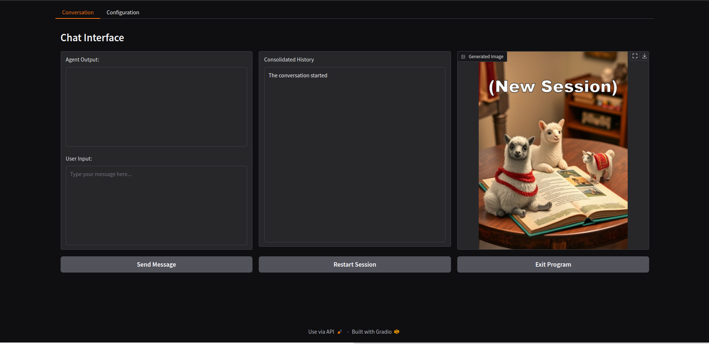

# Rpg-Gradio-Gguf
- Status: Project restart.

### Description
Its a Chatbot with, text and image, generation, tuned to RPG, that uses Gguf models to simulate limitless roleplaing in a Gradio interface in Web-Browser interface. 

### FEATURES
- Gguf Models: Compressed large language models with auto-configuration of model parameters. 
- Gradio Interface: A browser-based interactive interface tied seamlessly into terminal operations.
- Integrated Setup and Operation: Through a single Batch launcher script that manages installation and execution.
- 3 Prompt rotation for, conversation and consolidation and image generation, producing context aware experience.
- Persistence: Session data, settings, and configurations are retained across restarts.

### Preview
- The Conversation Page...



- The Configuration Page...


<details>
<summary>The installation processes...(ALPHA)</summary>

    ```
    ===============================================================================
        Rpg-Gradio-Gguf - Installation / Repair
    ===============================================================================
    
    ============================================================
      Rpg-Gradio-Gguf  —  Installer / Repair
    ============================================================
    
    Python version: 3.12.4
    
    [1/5] Creating directory structure...
      OK: ./data/
      OK: ./models/
      OK: ./models/text/
      OK: ./models/image/
      OK: ./scripts/
      OK: ./generated/
    
    [2/5] Creating virtual environment...
      Virtual environment already exists, skipping creation.
    
    [3/5] Installing Python packages into venv...
      -> Upgrading pip
    Requirement already satisfied: pip in .\venv\Lib\site-packages (26.0.1)
      -> Installing core packages
    Requirement already satisfied: gradio>=4.0 in .\venv\Lib\site-packages (6.6.0)
    Requirement already satisfied: Pillow in .\venv\Lib\site-packages (12.1.1)
    Requirement already satisfied: gguf-parser in .\venv\Lib\site-packages (0.1.1)
    Requirement already satisfied: aiofiles<25.0,>=22.0 in .\venv\Lib\site-packages (from gradio>=4.0) (24.1.0)
    Requirement already satisfied: anyio<5.0,>=3.0 in .\venv\Lib\site-packages (from gradio>=4.0) (4.12.1)
    Requirement already satisfied: brotli>=1.1.0 in .\venv\Lib\site-packages (from gradio>=4.0) (1.2.0)
    Requirement already satisfied: fastapi<1.0,>=0.115.2 in .\venv\Lib\site-packages (from gradio>=4.0) (0.129.2)
    Requirement already satisfied: ffmpy in .\venv\Lib\site-packages (from gradio>=4.0) (1.0.0)
    Requirement already satisfied: gradio-client==2.1.0 in .\venv\Lib\site-packages (from gradio>=4.0) (2.1.0)
    Requirement already satisfied: groovy~=0.1 in .\venv\Lib\site-packages (from gradio>=4.0) (0.1.2)
    Requirement already satisfied: httpx<1.0,>=0.24.1 in .\venv\Lib\site-packages (from gradio>=4.0) (0.28.1)
    Requirement already satisfied: huggingface-hub<2.0,>=0.33.5 in .\venv\Lib\site-packages (from gradio>=4.0) (1.4.1)
    Requirement already satisfied: jinja2<4.0 in .\venv\Lib\site-packages (from gradio>=4.0) (3.1.6)
    Requirement already satisfied: markupsafe<4.0,>=2.0 in .\venv\Lib\site-packages (from gradio>=4.0) (3.0.3)
    Requirement already satisfied: numpy<3.0,>=1.0 in .\venv\Lib\site-packages (from gradio>=4.0) (2.4.2)
    Requirement already satisfied: orjson~=3.0 in .\venv\Lib\site-packages (from gradio>=4.0) (3.11.7)
    Requirement already satisfied: packaging in .\venv\Lib\site-packages (from gradio>=4.0) (26.0)
    Requirement already satisfied: pandas<4.0,>=1.0 in .\venv\Lib\site-packages (from gradio>=4.0) (3.0.1)
    Requirement already satisfied: pydantic<=3.0,>=2.0 in .\venv\Lib\site-packages (from gradio>=4.0) (2.12.5)
    Requirement already satisfied: pydub in .\venv\Lib\site-packages (from gradio>=4.0) (0.25.1)
    Requirement already satisfied: python-multipart>=0.0.18 in .\venv\Lib\site-packages (from gradio>=4.0) (0.0.22)
    Requirement already satisfied: pytz>=2017.2 in .\venv\Lib\site-packages (from gradio>=4.0) (2025.2)
    Requirement already satisfied: pyyaml<7.0,>=5.0 in .\venv\Lib\site-packages (from gradio>=4.0) (6.0.3)
    Requirement already satisfied: safehttpx<0.2.0,>=0.1.7 in .\venv\Lib\site-packages (from gradio>=4.0) (0.1.7)
    Requirement already satisfied: semantic-version~=2.0 in .\venv\Lib\site-packages (from gradio>=4.0) (2.10.0)
    Requirement already satisfied: starlette<1.0,>=0.40.0 in .\venv\Lib\site-packages (from gradio>=4.0) (0.52.1)
    Requirement already satisfied: tomlkit<0.14.0,>=0.12.0 in .\venv\Lib\site-packages (from gradio>=4.0) (0.13.3)
    Requirement already satisfied: typer<1.0,>=0.12 in .\venv\Lib\site-packages (from gradio>=4.0) (0.24.1)
    Requirement already satisfied: typing-extensions~=4.0 in .\venv\Lib\site-packages (from gradio>=4.0) (4.15.0)
    Requirement already satisfied: uvicorn>=0.14.0 in .\venv\Lib\site-packages (from gradio>=4.0) (0.41.0)
    Requirement already satisfied: fsspec in .\venv\Lib\site-packages (from gradio-client==2.1.0->gradio>=4.0) (2026.2.0)
    Requirement already satisfied: idna>=2.8 in .\venv\Lib\site-packages (from anyio<5.0,>=3.0->gradio>=4.0) (3.11)
    Requirement already satisfied: typing-inspection>=0.4.2 in .\venv\Lib\site-packages (from fastapi<1.0,>=0.115.2->gradio>=4.0) (0.4.2)
    Requirement already satisfied: annotated-doc>=0.0.2 in .\venv\Lib\site-packages (from fastapi<1.0,>=0.115.2->gradio>=4.0) (0.0.4)
    Requirement already satisfied: certifi in .\venv\Lib\site-packages (from httpx<1.0,>=0.24.1->gradio>=4.0) (2026.1.4)
    Requirement already satisfied: httpcore==1.* in .\venv\Lib\site-packages (from httpx<1.0,>=0.24.1->gradio>=4.0) (1.0.9)
    Requirement already satisfied: h11>=0.16 in .\venv\Lib\site-packages (from httpcore==1.*->httpx<1.0,>=0.24.1->gradio>=4.0) (0.16.0)
    Requirement already satisfied: filelock in .\venv\Lib\site-packages (from huggingface-hub<2.0,>=0.33.5->gradio>=4.0) (3.24.3)
    Requirement already satisfied: hf-xet<2.0.0,>=1.2.0 in .\venv\Lib\site-packages (from huggingface-hub<2.0,>=0.33.5->gradio>=4.0) (1.2.0)
    Requirement already satisfied: shellingham in .\venv\Lib\site-packages (from huggingface-hub<2.0,>=0.33.5->gradio>=4.0) (1.5.4)
    Requirement already satisfied: tqdm>=4.42.1 in .\venv\Lib\site-packages (from huggingface-hub<2.0,>=0.33.5->gradio>=4.0) (4.67.3)
    Requirement already satisfied: typer-slim in .\venv\Lib\site-packages (from huggingface-hub<2.0,>=0.33.5->gradio>=4.0) (0.24.0)
    Requirement already satisfied: python-dateutil>=2.8.2 in .\venv\Lib\site-packages (from pandas<4.0,>=1.0->gradio>=4.0) (2.9.0.post0)
    Requirement already satisfied: tzdata in .\venv\Lib\site-packages (from pandas<4.0,>=1.0->gradio>=4.0) (2025.3)
    Requirement already satisfied: annotated-types>=0.6.0 in .\venv\Lib\site-packages (from pydantic<=3.0,>=2.0->gradio>=4.0) (0.7.0)
    Requirement already satisfied: pydantic-core==2.41.5 in .\venv\Lib\site-packages (from pydantic<=3.0,>=2.0->gradio>=4.0) (2.41.5)
    Requirement already satisfied: click>=8.2.1 in .\venv\Lib\site-packages (from typer<1.0,>=0.12->gradio>=4.0) (8.3.1)
    Requirement already satisfied: rich>=12.3.0 in .\venv\Lib\site-packages (from typer<1.0,>=0.12->gradio>=4.0) (14.3.3)
    Collecting argparse (from gguf-parser)
      Using cached argparse-1.4.0-py2.py3-none-any.whl.metadata (2.8 kB)
    Requirement already satisfied: colorama in .\venv\Lib\site-packages (from click>=8.2.1->typer<1.0,>=0.12->gradio>=4.0) (0.4.6)
    Requirement already satisfied: six>=1.5 in .\venv\Lib\site-packages (from python-dateutil>=2.8.2->pandas<4.0,>=1.0->gradio>=4.0) (1.17.0)
    Requirement already satisfied: markdown-it-py>=2.2.0 in .\venv\Lib\site-packages (from rich>=12.3.0->typer<1.0,>=0.12->gradio>=4.0) (4.0.0)
    Requirement already satisfied: pygments<3.0.0,>=2.13.0 in .\venv\Lib\site-packages (from rich>=12.3.0->typer<1.0,>=0.12->gradio>=4.0) (2.19.2)
    Requirement already satisfied: mdurl~=0.1 in .\venv\Lib\site-packages (from markdown-it-py>=2.2.0->rich>=12.3.0->typer<1.0,>=0.12->gradio>=4.0) (0.1.2)
    Using cached argparse-1.4.0-py2.py3-none-any.whl (23 kB)
    Installing collected packages: argparse
    Successfully installed argparse-1.4.0
      -> Installing llama-cpp-python (Vulkan build)...
      -> llama-cpp-python (Vulkan)
    Looking in indexes: https://pypi.org/simple, https://abetlen.github.io/llama-cpp-python/whl/vulkan
    Requirement already satisfied: llama-cpp-python in .\venv\Lib\site-packages (0.3.16)
    Requirement already satisfied: typing-extensions>=4.5.0 in .\venv\Lib\site-packages (from llama-cpp-python) (4.15.0)
    Requirement already satisfied: numpy>=1.20.0 in .\venv\Lib\site-packages (from llama-cpp-python) (2.4.2)
    Requirement already satisfied: diskcache>=5.6.1 in .\venv\Lib\site-packages (from llama-cpp-python) (5.6.3)
    Requirement already satisfied: jinja2>=2.11.3 in .\venv\Lib\site-packages (from llama-cpp-python) (3.1.6)
    Requirement already satisfied: MarkupSafe>=2.0 in .\venv\Lib\site-packages (from jinja2>=2.11.3->llama-cpp-python) (3.0.3)
      -> stable-diffusion-cpp-python
    Requirement already satisfied: stable-diffusion-cpp-python in .\venv\Lib\site-packages (0.4.5)
    Requirement already satisfied: typing-extensions>=4.5.0 in .\venv\Lib\site-packages (from stable-diffusion-cpp-python) (4.15.0)
    Requirement already satisfied: pillow>=10.2.0 in .\venv\Lib\site-packages (from stable-diffusion-cpp-python) (12.1.1)
    
    [4/5] Downloading llama.cpp Vulkan binaries...
      Vulkan binaries already present, skipping download.
    
    [5/5] Creating default configuration and assets...
      Config already exists: .\data\persistent.json
    
    
    ============================================================
      Installation Summary
    ============================================================
      [+] OK    Directories
      [+] OK    Virtual Environment
      [+] OK    Python Packages
      [+] OK    Vulkan Binaries
      [+] OK    Config & Assets
    ============================================================
      All steps completed successfully.
    
      Place your GGUF text model in  ./models/text/
      Place your GGUF image model in ./models/image/
      Then launch from the batch menu (option 1 or 2).
    ============================================================
    
    ----------------------------------------------------------------------
      Press any key to return to Batch Menu...
    ----------------------------------------------------------------------
    ```

</details>

### Requirements
- Windows - Without proper assessment of the scripts, its Windows 10.
- Python - Without proper assessment of the scripts, its Python 3.12.
- LLMs - The model we are using is [Wan2.1_T2V_14B_FusionX-GGUF](https://huggingface.co/QuantStack/Wan2.1_T2V_14B_FusionX-GGUF/tree/main)
- CPU - Any x64 Cpu, scripts use standard llama-cpp-python. 
- GPU - Vulkan capable GPU Only, it uses vulkan.
- Internet - Installer requires internet, main program will be offline.  

### Usage
Instructions are for upcoming GPU enhanced version...
```
t.b.a
```

### Notation
- T.B.A.


### File Structure
- Initial File Structure...
```
./
├── Rpg-Gradio-Gguf.bat        # Main Batch entry script
├── main_script.py             # Entry point to program, startup/shutdown functions, main loop
├── data/ 
│   ├── new_session.jpg        # Default Image
├── scripts/
│   ├── configure.py           # globals/maps/lists, load/save json functions
│   ├── displays.py           # Gradio interface, browser code
│   ├── inference.py               # GGUF model handling, model prompting
│   ├── utilities.py             # Utility functions
└── LICENSE.txt                # License file for the project
```
- Files Created by Installation...
```
./
├── data/
│   ├── __init__.py            # to mark the directory as a Python package
│   ├── persistent.json        # Holds default Chatbot configuration
├── venv/                      # Venv local install folder avoiding system conflict.
│   ├── *                      # Various libraries installed from `./data/requirements.txt`.
├── logs/                      # (Empty) Will contain any produced log files.
├── models/                    # (Empty) Directory for, `*.GGUF` and `model_config.json` ,files
```

 
### Development
The current plan for work featured is...
1. Restart and complete.

## DISCLAIMER:
- It is advided not to run the scripts in Alpha stage, or unexpected results may occur.
- Refer to License.Txt for terms covering usage, distribution, and modifications.
